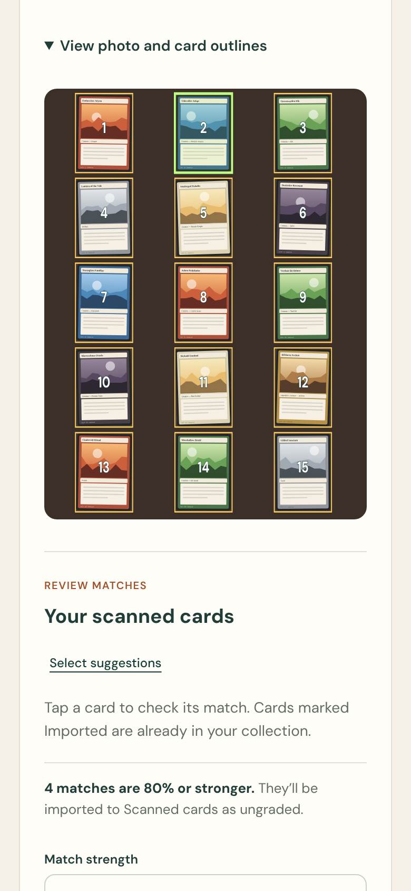
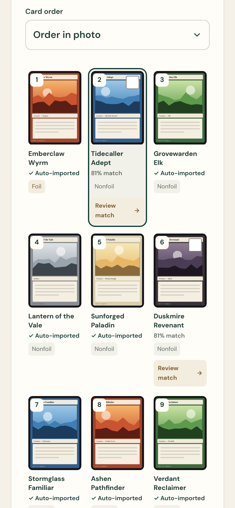
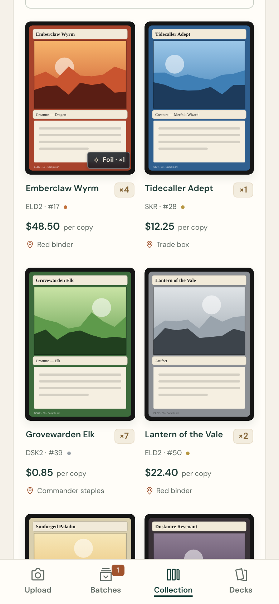
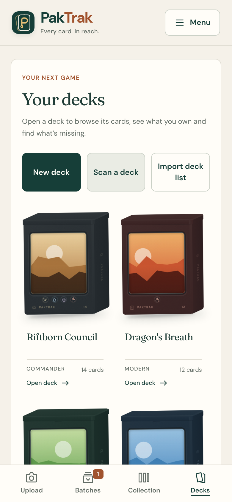
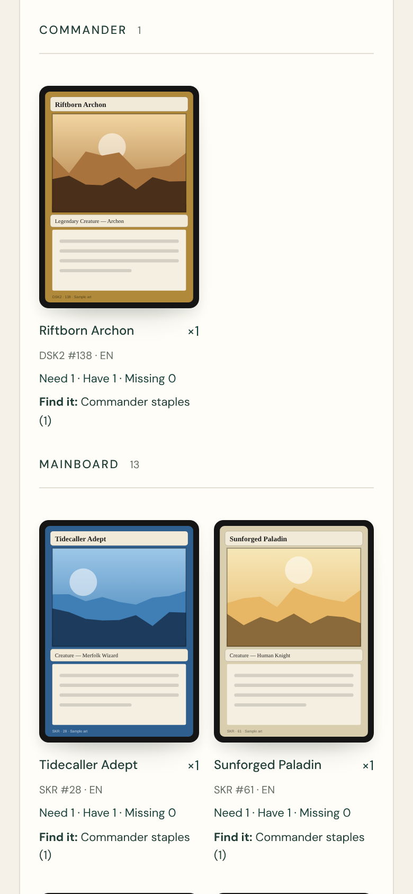
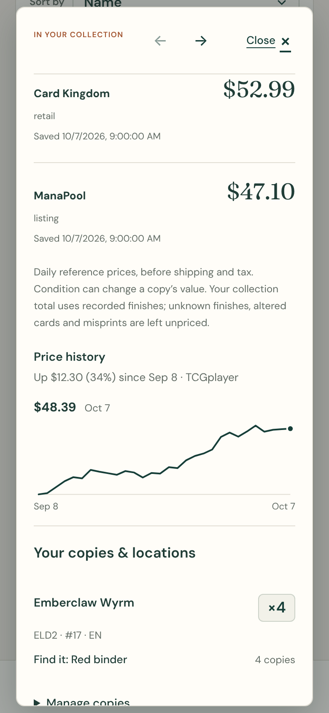
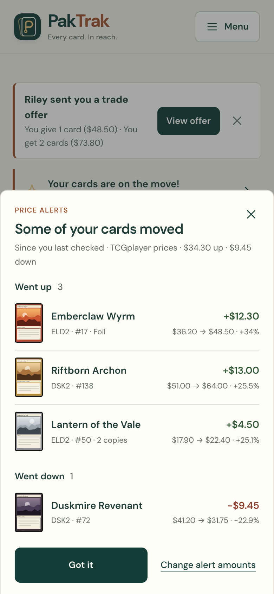
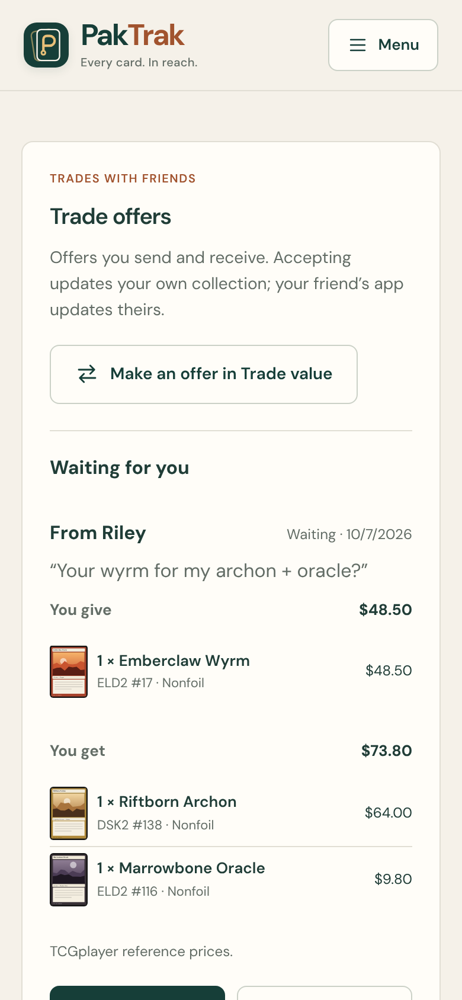
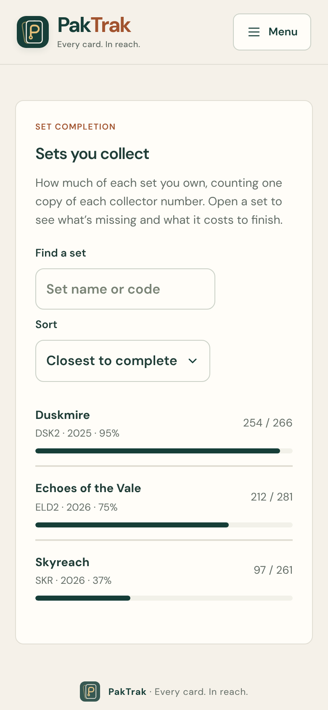

# PakTrak

**Every card. In reach.**

[](https://github.com/Addison16/PakTrak/releases/latest)
[](LICENSE)
[](https://github.com/Addison16/PakTrak/pkgs/container/paktrak)

PakTrak is a self-hosted Magic: The Gathering collection app for your phone's browser. Lay out a page of cards and take one photo. PakTrak outlines the cards it finds, suggests a printing for each, and adds the strongest matches to your collection on its own; anything it isn't sure about waits for a quick check, and you can add a card it missed. It runs on your own server, keeps your data there, and is free and open source under the [GNU AGPL v3](LICENSE).

<table>
  <tr>
    <td width="33%"></td>
    <td width="33%"></td>
    <td width="33%"></td>
  </tr>
  <tr>
    <td align="center">One photo, a whole page of cards</td>
    <td align="center">Strong matches import themselves</td>
    <td align="center">Every copy, price and binder</td>
  </tr>
  <tr>
    <td></td>
    <td></td>
    <td></td>
  </tr>
  <tr>
    <td align="center">Decks in their own boxes</td>
    <td align="center">What you own and where it is</td>
    <td align="center">Three price sources and history</td>
  </tr>
  <tr>
    <td></td>
    <td></td>
    <td></td>
  </tr>
  <tr>
    <td align="center">Alerts when your cards move</td>
    <td align="center">Trade offers between friends</td>
    <td align="center">Set completion</td>
  </tr>
</table>

<sub>Screenshots use sample cards and placeholder art. Real card images come from Scryfall once your server downloads the card catalog.</sub>

## Why PakTrak

- **Scans a whole page at once.** Most card scanners read one card at a time. PakTrak takes a photo of a binder page or a table full of cards, outlines each card, reads the name, set and collector number, and compares the artwork to suggest the printing. You confirm anything it isn't sure about.
- **Built for a phone, runs on your server.** Upload a photo and put your phone away. The server keeps working, and the results are waiting when you come back.
- **Knows where your cards are.** Every copy belongs to a binder or box, so a deck list can tell you which cards you own and where to find them.
- **Private by design.** Your collection stays on your server. Friends connect with private codes, and PakTrak never shows who else has an account.

## Features

### Scanning and adding cards
- Photograph up to a page of cards with the in-app camera, the phone's own camera or a photo from your library (JPEG, HEIC, PNG, WebP and more). See [photo formats](docs/PHOTO_FORMATS.md).
- Matches above 88% strength are added automatically; the rest get a quick guided review with suggested printings, crop correction and upside-down card handling. See [scanning](docs/SCANNING.md) and [the camera](docs/CAMERA.md).
- Tap the foils in a batch to mark them. Scan review tells you when you already own a card.
- Undo a whole batch later without touching cards from other scans.
- Import from other apps with CSV or plain text lists like `4 Lightning Bolt (M11) 146`, wishlist rows included. See [import formats](docs/IMPORT_FORMATS.md).

### Collection
- A searchable card gallery with copy counts, filters, saved views, shuffle and price sorting. Swipe through cards in the order you're viewing them.
- Binders and boxes: see where every copy lives, and move or reorganize cards in bulk.
- Collection value from TCGplayer, Card Kingdom or ManaPool, with a value-over-time chart and a price history for each card.
- Price alerts on Home when your cards go up or down by an amount you choose.
- Set completion with the cost to finish a set.
- Export to CSV or text at any time.

### Decks
- Saved decks shown as customizable deck boxes with commander artwork.
- Import a deck list or scan a physical deck across several photos.
- See which cards you own, which binder they're in, and what's still missing, with a buy list and buttons for TCGplayer, Card Kingdom and ManaPool.
- Deck value, format legality, token checklist, mana curve, sample opening hands, and export for MTG Arena or MTGO. See [decks](docs/DECKS.md).

### Friends and trading
- A wishlist with prices and store buttons.
- Add friends with a private friend code, browse each other's collections and wishlists, and send trade offers. Accepting updates each person's own collection.
- Trade value: add cards to both sides and see whether a trade is fair. See [wishlist, friends and trade offers](docs/FRIENDS.md).

### Everyday use
- Works offline: view your collection and decks without a connection and queue changes until the server is back. See [using PakTrak offline](docs/OFFLINE.md).
- Accounts for everyone in the house, with an administrator who approves new members and can set scan limits. See [account controls](docs/ACCOUNTS.md).
- Daily automatic backups on the single-container install, with download and restore from the app.
- Light and dark mode and five color themes.
- Card data and prices update daily on the server. See [card data and pricing](docs/CARD_DATA.md).

## Install

PakTrak runs in Docker on any Linux x86-64 (amd64) server. There is no default password; the first person to open it creates the administrator account.

### Try it with one command

On any server with Docker, replace `192.168.1.50` with your server's address and run:

```sh
docker run -d --name paktrak --restart unless-stopped --stop-timeout 120 \
  -p 8095:8095 -e APP_URL=http://192.168.1.50:8095 \
  -v paktrak-data:/data ghcr.io/addison16/paktrak:latest
```

The first start takes a few minutes. When `docker logs paktrak` shows **PakTrak is running**, open the address and choose **Create administrator account**. Everything PakTrak keeps is in the `paktrak-data` volume, so you can replace the container to update:

```sh
docker pull ghcr.io/addison16/paktrak:latest
docker stop paktrak && docker rm paktrak
```

Then run the `docker run` command above again.

### Unraid or a single container

The simplest setup is the all-in-one container `ghcr.io/addison16/paktrak`, which holds the database, sign-in service, photo storage and web app. On Unraid you add it from a template and update it from the **Docker** page like any other app. Follow the [Unraid guide](docs/UNRAID.md), which also covers HTTPS, backups and moving from a Docker Compose install.

### Docker Compose

Install Git and Docker with Compose 2.18 or newer, then run:

```sh
git clone https://github.com/Addison16/PakTrak.git
cd PakTrak
sh scripts/setup.sh
sh scripts/update.sh
```

Open **http://localhost:8095** and choose **Create administrator account**. Run `sh scripts/update.sh` again whenever you want the latest release. You can also run PakTrak with only `compose.yaml` and `.env`, without Git; see [Docker Compose without Git](docs/OPERATIONS.md#docker-compose-without-git).

### Using it from your phone

Put PakTrak behind HTTPS with a hostname so your phone can use the live camera and full offline mode, then add it to your Home Screen. The [Docker and HTTPS guide](docs/OPERATIONS.md#https-and-access-from-a-phone) covers reverse proxies, hostnames, updates and [backups](docs/OPERATIONS.md#upgrades-and-backups).

## For developers

Build from source with `sh scripts/start.sh --build`. Tests run with `sh scripts/test.sh` and `sh scripts/test-browser.sh`; [validation status](docs/STATUS.md) explains what is covered. See [architecture decisions](docs/ARCHITECTURE.md), the [release guide](docs/RELEASING.md), [quality of life notes](docs/QOL.md), [browser navigation](docs/NAVIGATION.md), [PakTrak's visual identity](docs/BRAND.md) and the [changelog](CHANGELOG.md). Contributions and security reports are covered by [CONTRIBUTING.md](CONTRIBUTING.md) and [SECURITY.md](SECURITY.md).

## License

PakTrak is free and open-source software under the [GNU Affero General Public License v3.0](LICENSE) (AGPL-3.0-only), with the project [notice](NOTICE). You may use, modify and share it, including commercially. Modified versions must stay under the AGPL with their source available, and if you run a modified version as a network service, you must offer its users the source. Third-party software, fonts and card data keep their own licenses; see [third-party notices](THIRD_PARTY_NOTICES.md) and [dependencies](docs/DEPENDENCIES.md).

Card data and images come from [Scryfall](https://scryfall.com/docs/api). Magic: The Gathering belongs to Wizards of the Coast. PakTrak is unofficial and is not endorsed by Wizards of the Coast or Scryfall.
