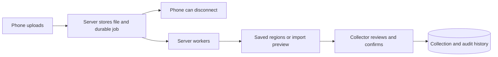

# PakTrak

**Every card. In reach.**

**Source-available for noncommercial use.** Original PakTrak code is licensed under [PolyForm Noncommercial 1.0.0](LICENSE); commercial use is not licensed. See [third-party notices](THIRD_PARTY_NOTICES.md) for separately licensed components.

A Magic: The Gathering collection app for phone browsers, built around Docker Compose. Upload a photo, wait for **server acceptance**, then put your phone away. Processing and collection transfers continue on the server. Explore your cards, track their binders and boxes, and save your next deck.

The [PakTrak camera](docs/CAMERA.md) includes a selector for available cameras, framing guides, bottom capture controls and photo review/retake. It remembers your working camera choice on the device; light and zoom appear when supported. The phone's native camera remains available for additional lens controls, full-resolution images and HEIC/HEIF capture.

Durable server-side photo identification, suggested-printing review, crop correction, reversible scan batches, collections, saved decks, and CSV/text import and export are implemented. Server-computed matches above 88% strength import automatically; the remaining suggestions have guided review. Enter a foil count before upload, then select foil cards in the batch to label finishes. See [scan batches](docs/SCANNING.md).

The [quality of life guide](docs/QOL.md) covers draft recovery, scan precision, saved collection views, bulk organization, partial moves, import repair and deck editing. Verified backup and restore scripts are documented in [operations](docs/OPERATIONS.md#upgrades-and-backups).

Decks have customizable cases, commander artwork banners and gallery layouts. Opening a case scatters cards with visible fronts, real Magic backs and thin edges before they settle into the deck. Selecting a card from a deck or collection spins it from its thumbnail into the detail viewer; reduced-motion preferences skip the transitions.

The [latest changes](CHANGELOG.md) include photo-to-deck scanning, deck values from three pricing sources, deck legality and token checklists, camera selection, account controls, and account-preserving hostname changes.

## Run with Docker

Install Docker Engine/Desktop with Compose. No host Python or Node installation is required.

```sh
git clone https://github.com/Addison16/PakTrak.git
cd PakTrak
sh scripts/setup.sh
sh scripts/start.sh
```

Open **http://localhost:8095** and choose **Create administrator account**. Choose your own username and a password with at least **8 characters**; there is no default app account. Keep `.env` and `infra/generated/` private; setup never prints their passwords. Complete first-admin setup before opening an installation for general access.

Setup runs once and refuses to overwrite existing configuration. Start can be repeated. If this workspace is already configured, run only `sh scripts/start.sh`. Builds support installations that have Compose but lack the optional Buildx plugin.

The default address is local to the server. For a phone, deploy behind HTTPS with a stable hostname; follow [the Docker and HTTPS guide](docs/OPERATIONS.md). Do not use the phone's `localhost` address to reach your server.

The data worker automatically prepares the default card catalog and daily price feeds. Open **Card data & prices** in the app for progress. `default_cards` includes English printings and cards available only in another printed language. For localized collections, follow the [all-language catalog instructions](docs/OPERATIONS.md#catalog-maintenance). The loader supports compressed JSON Lines exports and older JSON arrays, keeps previous printings when updating, and publishes changes in one database transaction. Provider artwork is cached on the server when viewed; it is not bundled with the application.

## What you can do

- Upload JPEG, PNG, WebP, HEIC/HEIF, AVIF, TIFF, BMP or still GIF photos, then close the browser after acceptance. The server verifies and stores the source, prepares a clean photo, and proposes separate card-shaped regions. Batches and results remain available after reconnecting. See [photo formats](docs/PHOTO_FORMATS.md) for file limits and multi-image behavior.
- Review each proposed region, search the local printing catalog, and deliberately add one physical copy. Unknown finish and ungraded condition remain explicit. Repeated decisions and worker retries cannot add that region twice.
- Create the first administrator through the setup screen. New signups are guests with **100 card scans total**, with no daily/monthly reset. Administrators approve guests as standard members with no total-card scan limit, and can turn new guest signup on or off. Approved members receive a congratulations message explaining unlimited scans at their next sign-in; dismissal is remembered. Existing accounts keep working when signup is closed.
- Import CSV with a column mapper, full CSV with retained source fields, or text lists such as `4 Lightning Bolt (M11) 146`. A saved preview requires confirmation; ambiguous printings remain available for review.
- See matching copies together as one card entry with a quantity such as **×4**, including copies added by different scans or imports. Each exact printing has its own count, with quantities by binder or box. Open **Manage copies** to inspect finish, condition and notes, move copies, or reduce their quantity.
- Export a consistent snapshot and undo an import's remaining copies without subtracting matching cards from other scans or imports.
- Create and rename storage locations for physical binders and boxes. Search a card to see where it is stored; move a whole inventory group to another location without losing its import history.
- Browse saved decks as a three-column deck-box gallery, with deck colors and commander artwork. Open a deck to explore its card images, edit quantities, and add or replace its list with a CSV/text import.
- Paste or import a deck list, including cards you still need. Matching prefers versions in your collection and compares by card name by default. See binder/box locations and export a missing-only buy list for TCGplayer, Card Kingdom or ManaPool. Mainboard, sideboard and commander sections are preserved; decks do not reserve or move cards. See [deck plans and buy lists](docs/DECKS.md).
- Scan a physical deck across multiple photos, approve matches, assign commander/mainboard/sideboard sections, and save it in Decks. **Deck only** is the default; **Also add scanned copies to my collection** is optional. Accepted photos continue processing on the server after the phone disconnects.
- View a deck's cached value using TCGplayer, Card Kingdom or ManaPool, including quantities, section subtotals, finish estimates and unpriced cards. Pricing follows the selected editions; missing quotes remain visible.
- Check a deck against the selected format's cached legality and construction rules, and see its linked token/emblem checklist. Unsectioned Commander imports put the first copy in the commander section, the next 99 in the mainboard, and remaining cards in extras; explicit sections and supported commander pairs remain available.
- Download CSV with common columns, plain text lists, or full CSV with reversible spreadsheet-safe escaping. Every export retains card quantities, including cards with unknown finish or condition.

Photo and CSV workers have separate queues. PostgreSQL stores authoritative jobs and replayable dispatch records, so a lost broker message does not strand accepted work. The phone performs no required recognition, CSV parsing, or collection commits.

New accounts get a short, four-step welcome tour covering navigation, the collection, ways to add cards, and organizing decks and storage. No upload is needed. Finish or skip it once; your account remembers across devices. Established accounts can try it through **Menu → Quick tour**, which also replays it at any time without changing collection data.

Use the header **Menu** button to open navigation from any signed-in screen. Collection is a searchable card-art gallery with duplicate counts, filters, shuffle, card details and storage locations. Your preferred pricing source is saved to your account, including when you sign in on another device. **Sort by** includes low-to-high and high-to-low prices across the full filtered collection, with unpriced cards last.

Your browser's **Back/Forward** controls and supported phone swipe-back gesture follow the screens you visit, including decks, batches, card previews and user accounts. Back closes an open menu first; unfinished edits retain their discard warnings. See [browser navigation](docs/NAVIGATION.md).

Choose **Menu → Appearance → Auto, Light or Dark**. Auto is the default and follows the device's current appearance, including changes while the app is open. Manual choices are remembered in this browser and shared with its other PakTrak tabs and sign-in/registration pages. The signed-out welcome screen also has the selector.

Under **Color theme**, choose **Forest** (the original green and cream), **Ocean** (blue), **Amethyst** (violet), **Ember** (terracotta), or **Slate** (neutral). Each palette has light and dark versions, and its preview follows your appearance mode. Colors apply immediately throughout the app and sign-in pages, stay in sync across tabs, and are remembered independently of Auto/Light/Dark. The same controls are available in **My account → Appearance**. Card artwork keeps its original colors.

**Menu → My account** shows your profile, scan usage, password-change link and other-device sign-out. **Administration → User management** lets admins reset user passwords, suspend/restore users, end sessions, pause scans and set lifetime card limits. A reset provides a temporary password to share privately, ends existing sign-ins and requires a new password at the next login. Members start unlimited on approval; admins can raise a cap or restore unlimited without resetting usage. See [account controls](docs/ACCOUNTS.md).

Errors name the failed action and offer dismissible, copyable details. Administrators can match request references under **Menu → Administration → Error logs**. Logs persist for up to 14 days / 10,000 entries and exclude request contents and credentials. See [error logs and sign-in recovery](docs/OPERATIONS.md#error-logs-and-sign-in-recovery).

Daily server updates supply Scryfall metadata/artwork, TCGplayer market estimates via Scryfall, Card Kingdom retail references and ManaPool near-mint listing prices. Missing prices and unknown finishes stay unpriced. Imports and data updates show measured progress estimates. See [card data and pricing](docs/CARD_DATA.md) for source meanings, caching and limits.

Changing the public hostname keeps your existing accounts and saved data. Configure the new DNS/proxy/TLS address, update `APP_URL`, and run `sh scripts/start.sh`; bootstrap updates the login configuration and preserves account ownership. On an older installation, first upgrade at its existing address before changing it. See [hostname changes](docs/OPERATIONS.md#https-and-access-from-a-phone).



## Verify the build

```sh
sh scripts/test.sh
sh scripts/test-browser.sh
sh scripts/test-accounts-browser.sh
```

The integration suite uses a separate `scanner_test` database and `scanner-test` bucket. Browser tests use disposable identity accounts and synthetic holdings; load the real catalog first. The account browser test additionally uses a temporary database and OIDC client with a separate loopback callback, preserving the live first-admin setup. Browser tests currently use Linux host networking. [Validation status](docs/STATUS.md) distinguishes automated evidence from remaining physical-device and real-photo qualification.

`sh scripts/test-recovery.sh` is an **interrupting development-instance test**: it closes the browser, deliberately clears this project's task broker, and recreates containers while preserving the database/photo volumes. Run it by itself on a development instance. It refuses to start with active non-test jobs. It is not a backup/restore test.

## Remaining work and release direction

Calibrated exact-printing recognition, targeted replacement close-ups, account deletion, backup/restore automation, and release hardening remain. A development photo now produces all 15 expected regions and card-name suggestions; a held-out real-photo benchmark, physical-phone testing and destination file interoperability checks are still needed. No universal 15-card accuracy or file compatibility claim is made.

PakTrak uses the [PolyForm Noncommercial License 1.0.0](LICENSE), with its [required notice](NOTICE). It permits the noncommercial uses, modifications and redistribution described in those terms; commercial use is not licensed. This is a source-available project, not an OSI open-source project. Third-party software, fonts and card data keep their own rights and notices; see [third-party notices](THIRD_PARTY_NOTICES.md) and [dependencies and source rights](docs/DEPENDENCIES.md). Contributions and security reports are covered by [CONTRIBUTING.md](CONTRIBUTING.md) and [SECURITY.md](SECURITY.md).

See [import formats](docs/IMPORT_FORMATS.md), [architecture decisions](docs/ARCHITECTURE.md), [PakTrak's visual identity](docs/BRAND.md), and the authoritative [product specification](Instructions/MTG_SCANNER_BUILD_INSTRUCTIONS.md). The supplied [PDF](Instructions/MTG_SCANNER_BUILD_INSTRUCTIONS.pdf) remains the original version 1.0 snapshot. It does not describe this implementation.

Card metadata comes from [Scryfall](https://scryfall.com/docs/api). Magic: The Gathering belongs to Wizards of the Coast. This project is unofficial and is not endorsed by Wizards of the Coast or Scryfall.
